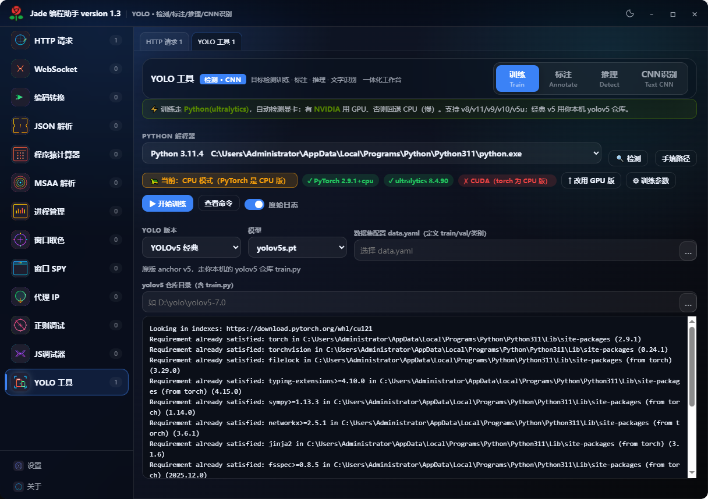
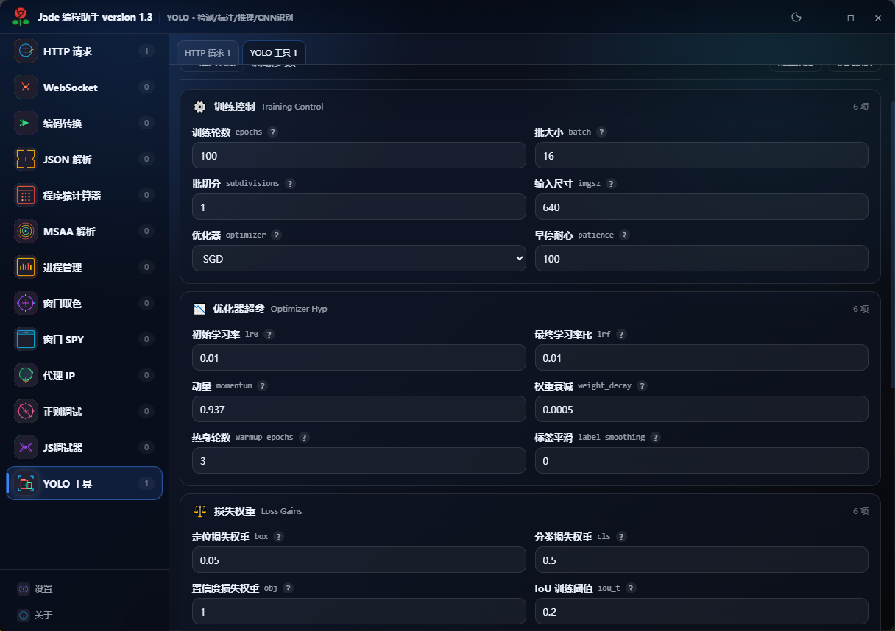

# 编程助手

一款面向 Windows 的开发辅助工具。把平时零散要开好几个小程序的事情收在一起：发个请求、看窗口结构、查进程、验编码、写正则、准备 YOLO 数据集。它不打算替代 IDE，只希望在需要这些工具时，少找一次、少切一次。

底层是原生 C++，界面使用 WebView2。两者各做自己适合的事：Windows 能力直接调，工具页面则保持轻量、好用。



## 能做什么

- HTTP / WebSocket 调试，支持导入 cURL、查看请求头和 HTTP 版本
- 编码、Base64、URL、十六进制、哈希、JSON、路径与常用代码片段
- 程序员计算器，覆盖十进制、十六进制、二进制和位运算
- 窗口 Spy、MSAA、取色、进程管理、代理检查、正则与 JavaScript 小测试
- YOLO 环境检查、训练命令准备、标注、ONNX 推理与结果查看



## 构建

项目面向 Windows x64，使用 Visual Studio 2019 或兼容的 C++ 工具链。

1. 打开 `project/ProgrammerAssistant.sln`。
2. 选择 `Release | x64` 编译，或在 PowerShell 执行 `./编译测试版.ps1`。
3. 从仓库根目录启动生成的 `编程助手.exe`。

测试版会直接读取 `web/` 目录。正式发布版依赖 `app.japk`，需先按项目的 JadePack 流程完成打包。

## YOLO 与 CNN

YOLO 页面支持 `.pt` 和 ONNX 检测模型；Python、Ultralytics 与模型依赖需要在本机准备好。

CNN 测试与 YOLO 流程相互独立。带自定义 Caffe 层的模型需要对应运行时，或先转换为 ONNX；OpenCV DNN 并不能执行所有 Caffe 自定义层。

## 目录

```text
src/       Windows 原生层与 IPC 实现
web/       界面及页面逻辑
project/   Visual Studio 解决方案与项目文件
sdk/       构建所需的 JadeView 头文件和导入库
docs/      文档与界面截图
```

## 作者与交流

- 作者：Peanut Soft
- QQ：245867
- 交流 QQ 群：1103426302（[点击加入](https://qm.qq.com/q/Fv9KjpGCEq)）

## 仓库说明

仓库发布源码和构建配置；本地模型、密钥、生成包、发布目录与运行缓存不会提交。
